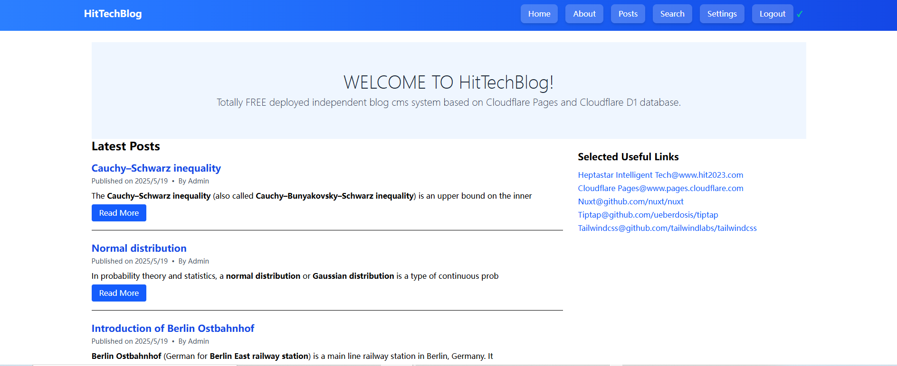
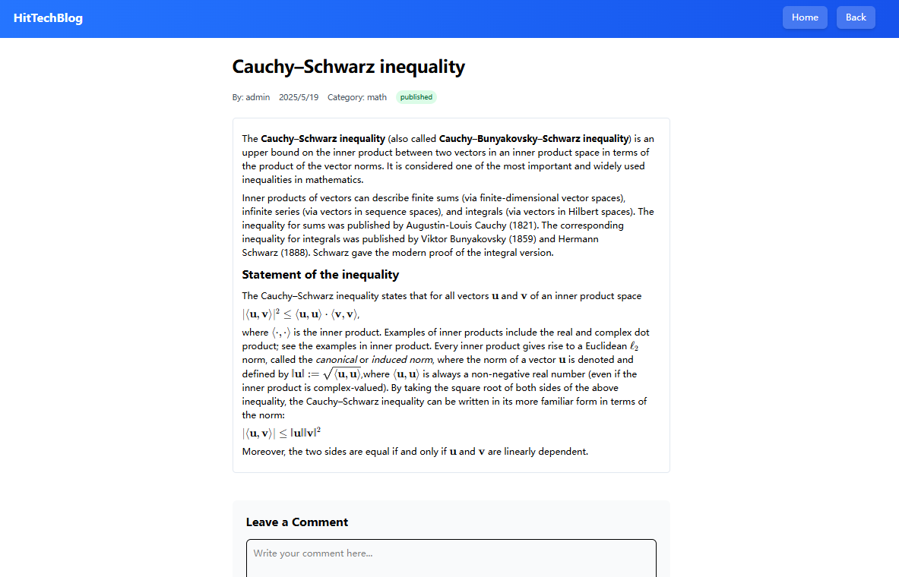
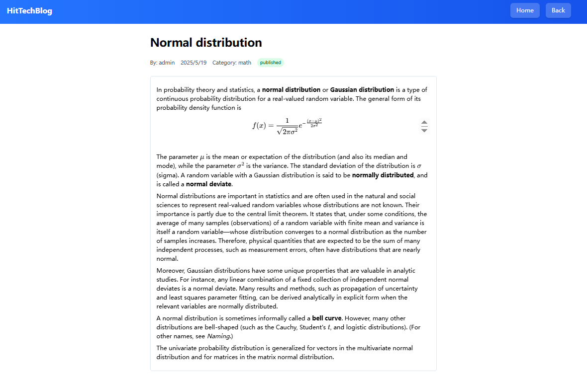

# 🌐 HitTechBlogV2: A Cloudflare D1 Database and Cloudflare Pages based Deploy-and-Maintain-Cost-Free Serverless-based Note-taking and Blog System, supporting both Image and Rich-text, responsive for PC and Mobile Phone, Nuxt3 Full-stack Project with Tailwindcss, NO USE of Cloudflare Workers ONLY Using Cloudflare Pages and D1 Database, ONLY 5 LINES CODE NEEDED to Production-Deploy
## 0. Demo
[https://www.hittech.online](https://www.hittech.online)
- admin account: admin@qq.com
- password: 122
- [中文教程，五行代码即可部署](https://zhuanlan.zhihu.com/p/1907909003209586056)

 
 
 
## 1. Introduction
- Welcome to HitTechBlogV2 Project!

### 1.1 Features:
- TOTALLY ZERO-COST-DEPLOY-AND-MAINTAIN note-taking and blog system which can be deployed and go online in seconds.
- NO SERVER NEEDED!!! but using FREE Cloudflare's severless Pages system with daily 100,000 free visit volume, ZERO COST.
- NO DATABASE NEEDED!!! but using FREE Cloudflare's D1 which is a sqlite database with 5G free space, ZERO COST.
- NO DOMAIN NAME NEEDED!!! but using FREE given one by Cloudflare Pages with pattern: http://www.your-self-domain-name.pages.dev

### 1.2 Functionalties:
- User registration and login using emails are supported.
- Creating, editing, and deleting blog posts for admin user whose userrank.
- Commenting on posts is supported for anonymous users.
- Searching for posts supporting full-text search for post's catefory, title and content in western and eastern languages.
- User settings: setting of blog name, hero title, hero content and displaying of selected links.
- Admin features: registered users' retrieving, updating and deleting and posts' creating, retrieving, updating and deleting.
- Use Tiptap rich text editor, supporting images, LaTex math formula based on Katex, code block, headings from H1 to H3, ordered list, unordered list, bold and italic.
- Personal note-taking and public posts, both modes are supported.
- This note-taking and blog system is both rich-text and image supported and both rich-text and image are stored in Cloudflare D1. Since Cloudflare D1 has restriction on row, hence images together in one post should not larger than 1M. 
## 2. Usage (use the following steps to install and use)
- go to https://www.cloudflare.com/ to register an account for using free Cloudflare Pages and D1 database
### 2.0 Download
- download or clone the project to local windows or macbook machine.
### 2.1 Install
- change the name of envexample.txt under root folder of the project to .env
- under the root folder of the project, run the following command to install needed packages listed in package.json
~~~
npm install -g wrangler

npm install
~~~
### 2.2 Cloudflare D1 database settings
- create a D1 database named htbblogd1imgpgdb250520
~~~
npx wrangler d1 create htbblogd1imgpgdb250520
~~~
- you will obtain the following result
~~~

 ⛅️ wrangler 4.14.4 (update available 4.15.2)
-------------------------------------------------------
✅ Successfully created DB 'htbdb250519' in region WNAMCreated your new D1 database.

{
  "d1_databases": [
    {
      "binding": "DB",
      "database_name": "htbblogd1imgpgdb250520",
      "database_id": "obtained-your-specific-database-id"
    }
  ]
}
~~~
- add the previous json data to wrangler.jsonc, see example in the following
~~~

{
	"$schema": "node_modules/wrangler/config-schema.json",
	"name": "htb-blogd1pages-250515a1122-js-nu-cfpages",
	"compatibility_date": "2025-05-15",
	"pages_build_output_dir": "./dist",
	"observability": {
		"enabled": true
	},
	"d1_databases": [
		{
		  "binding": "DB",
		  "database_name": "htbblogd1imgpgdb250520",
		  "database_id": "obtained-your-specific-database-id"
		}
	  ]
~~~
- then go to execute commands to create related tables and indices
- all tables and indices can be done with command individually for remote and local: 
~~~shell
npx wrangler d1 execute htbblogd1imgpgdb250527 --remote --file schemas/allinone2.sql
npx wrangler d1 execute htbblogd1imgpgdb250527 --file schemas/allinone2.sql
~~~

### 2.3 start the project
- run the project in local machine
~~~
npm run dev
~~~

#### 2.3.1 add an admin account in local (OPTIONAL)
- go to server\api\user\register.ts
- modify line 27
~~~
    await db.prepare('INSERT INTO users (email, password_hash, userrank) VALUES (?, ?, 0)')
~~~
to the following, 0 is changed to 3
~~~
    await db.prepare('INSERT INTO users (email, password_hash, userrank) VALUES (?, ?, 3)')

~~~
- then restart project
~~~
npm run dev
~~~
- then go to register an admin account, then stop the project and go to change 3 back to 0 in line 27 of server\api\user\register.ts
- then restart the project and login with the admin account,
- everything is all DONE in local.

#### 2.3.2 customize blog
- customize the blog as you want by modifying variables' values in .env file
~~~

BLOG_NAME="HitTechBlogV2"
HERO_TITLE="WELCOME TO HitTechBlogV2!"
HERO_CONTENT="Totally FREE deployed independent blog cms system based on Cloudflare Pages and Cloudflare D1 database."
LINK1LABEL="Heptastar Intelligent Tech@www.hit2023.com"
LINK2LABEL="Cloudflare Pages@www.pages.cloudflare.com"
LINK3LABEL="Nuxt@github.com/nuxt/nuxt"
LINK4LABEL="Tiptap@github.com/ueberdosis/tiptap"
LINK5LABEL="Tailwindcss@github.com/tailwindlabs/tailwindcss"

LINK1URL="https://hit2023.com/"
LINK2URL="https://pages.cloudflare.com/"
LINK3URL="https://github.com/nuxt/nuxt"
LINK4URL="https://github.com/ueberdosis/tiptap"
LINK5URL="https://github.com/tailwindlabs/tailwindcss"
~~~

#### 2.3.3 preview before deploy to remote (OPTIONAL)
- check if the blog fulfill your expectation
~~~
npm run preview
~~~

#### 2.3.4 formal deploy the project to Cloudflare Pages
- use the command to login then deploy which will upload all needed files to remote 
~~~
npx wrangler login
npm run deploy
~~~
- it may encounter Cloudflare login, then use your registered account to finish login
- then the project will be uploaded and deployed to the remote, then you will obtain success response from remote if ALL DONE.
~~~
 Compiled Worker successfully
✨ Uploading Worker bundle
✨ Uploading _routes.json
🌎 Deploying...
✨ Deployment complete! Take a peek over at https://YourSpecificAssignedName.pags.dev
~~~
- then go to browser to open url:https://YourSpecificAssignedName.pags.dev, it may cost a little while that the remote can finish the first time deploy.

#### 2.3.5 set admin account with setting userrank from 0 to 3 after deploy (REQUIRED!!!)
- open url https://YourSpecificAssignedName.pags.dev then click login button then click register link to register admin account, e.g. admin@qq.com
- sign in on cloudflare-> side-bar-> Storage & Databases-> D1 SQL Database-> htbblogd1imgpgdb250520 (previously created D1 database)-> tables-> users (created by previous command and used for store user registeration)
- check the admin@qq.com then go to update by clicking the button in the tail of the row, to change the userrank from 0 to 3 which is the admin's rank.
- BY HERE ALL DONE YOU CAN ENJOY TO POST YOUR MASTER-WORK.

# 3. Contact
- HitTechBlogV2 is continuously dev and maintained by [Heptastar Intelligent Tech](https://www.hit2023.com). Any questions or suggestions please contact us: [Heptastar Intelligent Tech](https://www.hit2023.com)
- Github addr: https://github.com/heptastar/HitTechBlogV2
  

